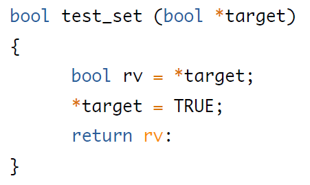
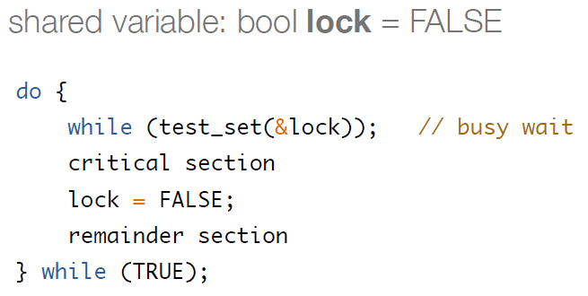

## OS

[TOC]

### introduce

- RISC：没有直接操作内存的指令

- 中断发生的时候，CPU跳到固定地址，执行特定的程序
  - 操作系统放的程序
  - 中断控制器告诉谁发生了中断
  
- trap：同步性质的中断
  - 需要CPU打断原来程序的执行
  - 应用调用API，再调用syscall，主动发生
  
- 上下文
  - 栈指针
  - PCB：processor control block
  - MMU：Memory Management Unit
  
- 异步：不用等IO

- ssd中的操作系统：特定的目的：均匀擦除

- Dual-mode operation
  - CPU一定至少提供两个模式：非特权与特权
  - 非特权不能直接访问IO
  - 特权模式可以直接操作页表、硬件设备
  - 用户态和内核态
  
- Hypervisor：隔离不同的操作系统

- stack与heap
  
  - heap：动态分配的内存
  
- full tickless operation
  
  - https://lwn.net/Articles/549580/
  
- 并发和并行

- 线程之间可以共享资源，虚拟地址空间是一样的
  - 缺点：线程之间没有安全的边界概念
  - 线程之间同步非常困难
  
- 内存管理
  
  - 物理内存管理
  
- 文件系统

- 函数指针
  - 性能不好：流水线会被打断
  - 安全性有影响：数据能决定会调用什么函数
  
- 机制mechanism和策略policy

- # **陷阱**

  计算机有两种运行模式：用户态， 内核态。 其中操作系统运行在内核态，在内核态中，操作系统具有对所有硬件的完全访问权限，可以使机器运行任何指令；相反，用户程序运行在用户态，在用户态下，软件只能使用少数指令，它们并不具备直接访问硬件的权限。这就出现了问题，假如软件需要访问硬件或者需要调用内核中的函数该怎么办呢，这就是陷阱的作用了。陷阱指令可以使执行流程从用户态陷入内核（这也就是为什么叫做陷阱，而不是捕猎的陷阱）并把控制权转移给操作系统，使得用户程序可以调用内核函数和使用硬件从而获得操作系统所提供的服务，比如用视频软件放一个电影，视频软件就发出陷阱使用显示器和声卡从而访问硬件。

  操作系统有很多系统调用接口供用程序调用。陷阱的发生时间是固定的，比如第一次用视频软件时，在加载视频时软件会向操作系统发送陷阱指令，第二次播放时，软件仍然会在同样的时刻发送陷阱指令。这一点是和中断的明显的差别之一。下面介绍中断。

  # **中断**

  中断是由外部事件导致并且它发生的时间是不可预测的，这一点和陷阱不同。外部事件主要是指时钟中断，硬件中断等。由于CPU一次只能运行一条指令，所以在一个时刻只能有一个程序运行，但我们感觉在我们的计算机中明明可以同时运行很多程序啊，这是由于CPU在多个进程之间快速切换所导致的伪并行。如果某一个程序运行了足够长用完了分配给它的时间片，CPU决定切换到另一个进程运行，就会产生一个时钟中断，切换到下一个进程运行。

  硬件中断顾名思义就是由硬件引起的中断，比如一个程序需要用户输入一个数据，但用户一直没有输入，操作系统决定是一直等待用户输入还是转而运行别的进程，一般情况是转而运行别的进程，如果用户的输入到来了，那么键盘驱动器会产生一个中断通知操作系统，操作系统保存正在运行的程序的状态，从而切换到原来的进程处理到来的数据。

  所以中断发生是随机的且主要作用是完成进程间切换，从而支持CPU和设备之间的并行。
  中断和异常的另一个重要差别是，CPU处理中断的过程中会屏蔽中断，不接受新的中断直到此次中断处理结束。而陷阱的发生并不屏蔽中断，可以接受新的中断。

  # **异常**

  异常就是程序执行过程中的异常行为。比如除零异常，缓冲区溢出异常等。不同的操作系统定义了不同种类和数量的异常并且每个异常都有一个唯一的异常号，异常会扰乱程序的正常执行流程，所以异常是在CPU执行指令时本身出现的问题，比如除数为零而出现的除零异常。异常的产生表示程序设计不合理，所以在编程的时候要尽量避免异常的产生。

- # Trap (computing)

  From Wikipedia, the free encyclopedia

  [Jump to navigation](https://en.wikipedia.org/wiki/Trap_(computing)#mw-head)[Jump to search](https://en.wikipedia.org/wiki/Trap_(computing)#searchInput)

  In [computing](https://en.wikipedia.org/wiki/Computing) and [operating systems](https://en.wikipedia.org/wiki/Operating_systems), a **trap**, also known as an **exception** or a **fault**, is typically[[NB 1\]](https://en.wikipedia.org/wiki/Trap_(computing)#cite_note-1)[[1\]](https://en.wikipedia.org/wiki/Trap_(computing)#cite_note-2) a type of [synchronous](https://en.wikipedia.org/wiki/Synchronization_(computer_science)) [interrupt](https://en.wikipedia.org/wiki/Interrupt) caused by an [exceptional](https://en.wikipedia.org/wiki/Exception_handling) condition (e.g., [breakpoint](https://en.wikipedia.org/wiki/Breakpoint#Hardware), [division by zero](https://en.wikipedia.org/wiki/Division_by_zero), [invalid memory access](https://en.wikipedia.org/wiki/Segmentation_fault)). A trap usually results in a switch to [kernel mode](https://en.wikipedia.org/wiki/Kernel_mode), wherein the operating system performs some action before returning control to the originating process. A trap in a kernel [process](https://en.wikipedia.org/wiki/Process_(computing)) is more serious than a trap in a user process, and in some systems is [fatal](https://en.wikipedia.org/wiki/Crash_(computing)#Operating_system_crashes). In some usages, the term *trap* refers specifically to an interrupt intended to initiate a [context switch](https://en.wikipedia.org/wiki/Context_switch) to a [monitor program](https://en.wikipedia.org/wiki/Profiler_(computer_science)) or [debugger](https://en.wikipedia.org/wiki/Debugger).[[2\]](https://en.wikipedia.org/wiki/Trap_(computing)#cite_note-3)

- 

- 


### Operating System Services & Structures

- 操作系统提供的服务 User-Visible
  - ...
  - Communications
    - 指的是一个进程和另一个进程之间交换信息
    - 可能发生在同一台计算机，或网络连接的两个计算机系统
    - 实现方式：shared memory; message passing
      - 共享内存：多个进程读写同一块共享的内存
      - 消息传递：packets of information in predefined formats are  moved between processes by the operating system
- 系统角度
  - 资源分配
    - CPU cycles, main memory, file storage 可能有特殊分配的代码
      - CPU：调度，CPU速度，进程的优先度，CPU核数等
    - I/O 设备 可能有更通用的要求和发布的代码
  - Logging：跟踪每个程序用了多少、哪种计算机资源
  - Protection and security
    - isolation：进程之间不能互相干扰
    - protection is the mechanism, security towards the policy

#### System calls

- 实现

  - 每个system call与一个数字相关联：**syscall number**
  - 系统调用接口维护一个表，由这些数字作为索引
  - Linux有约340个系统调用，x86 349，arm 345

- RTE：Run-Time Environment

- 三种传递参数给操作系统的方式

  - 参数放至**寄存器**
  - 参数放至内存的**block**或table中，同时**块地址**需要存放在寄存器中
  - 参数可以由程序**压**入**栈**中，再由操作系统出栈

- a dump of memory：备份、转储

- 系统调用的类型：...

- ioctl：io control

  - ```c
    #include <sys/ioctl.h>
    int ioctl(int fd, unsigned long request, ...);
    ```

  - 向设备发送请求码

- MS-DOS
  - single-tasking
  - 当运行一个程序时
    - 没有进程创建
    - 只有一个内存空间
    - 把程序装载至内存，除了kernel之外全部overwriting
    - 程序结束，shell重新加载
  - 
- FreeBSD
  - shell执行fork()系统调用，创建进程
  - 然后调用exec()装载程序到进程中
  - shell等待进程结束，或继续接收用户的命令
- System services
  - ...
  - Backgroud services
    - Constantly running system-program processes are known as services, subsystems, or **daemons** **守护进程**

#### linker and loader

- linker 链接器：**从object文件到executable文件**
  - .c 编译为 .o，.o再链接成可执行文件
  - -lm：链接数学库
  - 数学库 -lm; posix线程 -lpthread; lc 是link libc; lm 是link libm; lz 是link libz
  
- loader：**从程序到进程**
  - 执行时如何从磁盘加载
  - 解析动态库
  - lazy binding
  - eligible：有资格的
  
- relocation
  - 把最终地址赋给程序的各个部分
  - 调整程序中代码和数据，从而匹配这些地址
  - 从而代码可以调用library的函数，在它运行时访问到它的变量
  
- ./main
  - fork()创建子进程
  - 把可执行文件名传递给exec()
  - 然后装载器把程序装载进内存，用新生成的进程的地址空间
  
- 

- 静态链接
  - objdump
  - 生成的可执行文件是自包含的，都会放在可执行文件中
  - 可执行文件大，多份可执行文件会造成内存浪费（不共享内存）
  
- 动态链接
  - 内存中只有一份
  - 可以实现模块更新时不会导致整体的重新链接（合并和重定位）
  - 因此模块和主体在装载之前是分离的
    - 实现模块可以先存在物理内存
  - DLLs：dynamically linked libraries
  - 链接器插入relocation information，使得它能够被动态链接
  - 当程序被装载时再被装载
  - 多进程可以共享DLLs，从而节省内存
  - 会产生新的问题：装载时链接，若采用固定的地址装载模块，会导致地址冲突，从而**必须实现模块能在任何地址加载**
  
- 实现模块任意地址加载

- obj文件和exe文件的标准格式
  - containing **compiled machine code** and **a symbol table** containing metadata about functions and variables that are referenced in the program.
  - UNIX：标准格式称为ELF（Executable and Linkable Format）
  - 

- Why apps are OS specific
  - 如何使得不specific
    - 解释型语言
    - VM
    - 只用标准的APIs
  - 为什么很困难
    - different binary format: ELF vs PE
      - Windows systems use the Portable Executable (PE) format, and macOS uses the Mach-O format.
    - 不同的CPU指令集
    - 不同的系统调用接口
  - WSL：Windows Subsystems for Linux
  
- **交叉编译**

  - ！！！！

- 程序员的自我修养——链接、装载与库：动态链接

  - https://blog.csdn.net/fengbingchun/article/details/101120761

  - 主流操作系统

    - Linux：ELF动态链接文件称为**DSO**（Dynamic Shared Objects）
      - 简称为**共享对象**
      - **扩展名 .so**
    - Windows：DLLs（Dynamical Linking Library）
      - .dll

  - Program1.c、Program2.c、Lib.c、Lib.h

    - 脚本build.sh，生成动态库Lib.so，可执行文件Program1和Program2

      ```shell
      gcc -fPIC -shared -o Lib.so Lib.c
      gcc -o Program1 Program1.c ./Lib.so
      gcc -o Program2 Program2.c ./Lib.so
      ```

    - Lib.so中保存了完整符号信息，Lib.so也作为链接的输入文件之一

      - 这样在链接器解析符号时就知道foobar是一个定义在Lib.so的动态符号

    - 在程序运行时

      - 静态链接的可执行文件，整个进程只有一个文件要被映射
      - 动态链接：本身+所依赖的共享目标文件

    - **动态链接器与普通共享对象一样被映射到了进程的地址空间**，在系统开始运行Program1之前，首先会把控制权交给动态链接器，由它完成所有的动态链接工作以后再把控制权交给Program1，然后开始执行。

      

    - 可以用readelf工具查看Lib.so的装载属性

      - **动态链接模块**Lib.so的装载地址是从地址0x0000000000000000开始的

    - 静态链接：Link Time Relocation

    - 动态链接：Load Time Relocation

- Load-time relocation of shared libraries

  - https://eli.thegreenplace.net/2011/08/25/load-time-relocation-of-shared-libraries/#id14

  - **dynamic loader**：一段代码，负责程序运行的准备工作

    - One of its tasks is to load shared libraries from disk into memory, when the running executable requests them.
    - When a shared library is loaded into memory, it is then adjusted for its newly determined load location.

  - 将ml_main.c编译成.so文件

    - -o：重命名输出文件
    - -g：在可执行程序中包含标准调试信息

    ```shell
    gcc -g -c ml_main.c -o ml_mainreloc.o 
    gcc -shared -o libmlreloc.so ml_mainreloc.o
    ```

  - 查看libmlreloc.so文件的ELF头

    - the linker just links the shared object for address `0x0` (the `.text` section starting at `0x3b0`)

    ```
    $ readelf -h libmlreloc.so
    ELF Header:
      Magic:   7f 45 4c 46 01 01 01 00 00 00 00 00 00 00 00 00
      Class:                             ELF32
      [...] some header fields
      Entry point address:               0x3b0
      [...] some header fields
    ```

  - 查看.so文件的反汇编

    - It appears that the actual operand of `mov` is just `0x0` [8]. What gives? This is how relocations work. The linker places some provisional pre-defined value (`0x0` in this case) into the instruction stream, and then creates **a special relocation entry pointing** to this place.

    ```
    $ objdump -d -Mintel libmlreloc.so
    
    libmlreloc.so:     file format elf32-i386
    
    [...] skipping stuff
    
    0000046c <ml_func>:
     46c: 55                      push   ebp
     46d: 89 e5                   mov    ebp,esp
     46f: a1 00 00 00 00          mov    eax,ds:0x0
     474: 03 45 08                add    eax,DWORD PTR [ebp+0x8]
     477: a3 00 00 00 00          mov    ds:0x0,eax
     47c: a1 00 00 00 00          mov    eax,ds:0x0
     481: 03 45 0c                add    eax,DWORD PTR [ebp+0xc]
     484: 5d                      pop    ebp
     485: c3                      ret
    
    [...] skipping stuff
    ```

  - 查看libmlreloc.so文件的重定位段信息

    - The `rel.dyn` section of ELF is reserved for **dynamic (load-time) relocations**, to be **consumed by the dynamic loader.**

    ```
    $ readelf -r libmlreloc.so
    
    Relocation section '.rel.dyn' at offset 0x2fc contains 7 entries:
     Offset     Info    Type            Sym.Value  Sym. Name
    00002008  00000008 R_386_RELATIVE
    00000470  00000401 R_386_32          0000200C   myglob
    00000478  00000401 R_386_32          0000200C   myglob
    0000047d  00000401 R_386_32          0000200C   myglob
    [...] skipping stuff
    ```

  - ...

#### OS Structure

- Mechanism: how to do; Policy: what will be done

##### Simple Structure: MS-DOS

- 没有结构，没有模块化
- 为了尽可能利用空间

#####  Monolithic Structure: Original UNIX

- 有限的结构

- 两个分开的层次

  - systems programs
  - the kernel: 在系统调用接口之下，硬件之上

- Linux

  - monolithic：it runs entirely in kernel mode **in a single address**
    **space**
  - it does have a modular design that allows **the kernel to be modified during run time.**
  - 这种方式速度快（UNIX, Linux, and Windows）

- Layered Approach

  - layer 0，the hardware

- Microkernels

  - 从kernel中移去非必要的成分
  - 对于这些成分，以用户层程序的方式实现，将这些程序放至不同的地址空间
  - 
  - 客户程序和服务不能直接交互，需要通过微内核交换信息
  - 扩展简单，修改少，跨平台
  - 安全性更高：当一个服务fails，os的其他部分没事
  - 速度慢：当两个用户层的服务需要交互时，信息必须复制，存储在两个不同的地址空间；the operating system may have to switch from one process to the next to exchange the messages.

- Modules

  - **loadable kernel modules** (LKMs)
  - 内核只包含一组核心的组件，可以通过modules动态地链接其他附加的服务（boot time or run time）
  - adding newfeatures directly to the kernel：需要重新编译内核
  - 例如，将CPU调度和memory管理算法写入内核，其他作为loadable modules
  - it is more flexible than a layered system, because **any module can call any other module.**

- Hybrid Systems

  - Linux
    - monolithic：os在单一的地址空间，performance好
    - modular：新功能可以动态加入内核
  - Windows
    - largely monolithic
    - retains some behavior typical of microkernel systems
      - providing support for separate subsystems (known as operating-system personalities) that run as user-mode processes.
    - support dynamically loadable kernel modules
  - macOS and iOS

- Exokernel

- Comparison

  


### Process

- 区分是否初始化：
  - 可执行文件的大小
  - 没有被初始化：只需要存有这么一个变量即可，不需要存它的值
- malloc和free没有对应的system call
  - libc在用户态完成
  - libc一次性申请一个比较大的空间的堆，然后自己进行管理（malloc和free）
  - 有一个系统调用（_mm_malloc？），可以申请更大的heap空间
- 线程
  - 每一个线程在操作系统看来都是可以被调度的实体
  - 为每个线程maintain：
    - PC
    - register
    - ...
  - 每个执行的实体都可以access stack, heap, data, text
- swap in/out
  - 换出：写到磁盘
- COW：优化进程创建
- **4.9** Under what circumstances does a multithreaded solution using multiple **kernel threads** provide better performance than a single-threaded solution on a single-processor system?


4.2描述一下线程库采取行动进行用户级线程上下文切换的过程

答：用户线程之间的上下文切换和内核线程之间的相互转换是非常相似的。但它依赖于线程库和怎样把用户线程指给内核程序。一般来说，用户线程之间的上下文切换涉及到用一个用户程序的轻量级进程（LWP）和用另外一个线程来代替。这种行为通常涉及到寄存器的节约和释放。


### CPU Scheduling

#### Preemptive and Nonpreemptive Scheduling

- CPU调度可能发生在在以下事件发生的时候：某个进程从a状态到b状态
  - running -> waiting：I/O请求，wait()函数调用（for the termination of a child process）
  - running -> ready：一个中断发生（时间片用完了，被剥夺了继续运行的privilege）
  - waiting -> ready：I/O结束
  - terminates
- 1和4是nonpreemptive的（也称cooerative scheduling）
  - CPU此时必须要发生调度
  - 一旦CPU被这个进程占用，它就一直占用，直到它terminates或进入等待状态（等待I/O）CPU才被释放
- 2和3是preemptive的
  - 不一定要发生调度（一个进程抢占另一个进程）
  - 在这两种情况发生的时候有调度，实际上抢了别人，即抢占式
  - 实际上Windows, macOS, Linux等都用抢占式调度算法
  - **抢占式调度需要硬件支持，比如timer**
    - 如果没有定时器，没有机会去抢占它
    - 定时器可以定期去看一下ready队列，比较一下队列里面的和当前运行的进程的优先级
    - ready队列里的抢占了当前正在跑的
  - **synchronization primitives are necessary** ？
    - 当数据被多个进程共享时，**抢占式调度会产生race conditions**
      - 当进程A在更新数据时它被B抢占了，B尝试读这些共享的数据，导致不一致
- Kernel Preemption
  - 现在大多数都是fully preemptive when running in kernel mode
  - 当更新共享数据时被抢占了，内核状态会不一致（当内核正在执行一个系统调用时发生了中断）
  - 例子：
    - 在执行某个系统调用时，内核可能正在修改重要的内核数据（例如I/O队列）
    - 如果修改时被抢占了，且内核（或设备驱动）需要读或修改同样的结构，就会混乱
  - 内核可以设计为非抢占或抢占
    - 非抢占：在做上下文切换之前，先等待当前系统调用完成或I/O请求结束
      - waiting either the system call to complete or I/O block
      - **(still a preemptive scheduling for processes!)**
      - 内核结构简单：当内核数据结构处于不一致状态时，内核不会抢占一个进程
        - 同一时刻只有一个
      - 支持real-time computing不好（任务必须在给定time frame完成执行）
    - 抢占：需要支持mutex locks（互斥锁）来防止race condition（当访问共享内核数据结构时）
- 中断（？）
  - Because interrupts can, by definition, occur at any time, and because they
    cannot always be ignored by the kernel, the sections of code affected by interrupts
    must be guarded from simultaneous use. 防止被同时使用 The operating system needs to
    accept interrupts at almost all times. Otherwise, input might be lost or output
    overwritten. So that these sections of code are not accessed concurrently by
    several processes, they disable interrupts at entry and reenable interrupts at
    exit. It is important to note that sections of code that disable interrupts do not
    occur very often and typically contain few instructions.

#### Dispatcher

- gives control of the CPU’s core to the process selected by the CPU scheduler
- 把CPU调度器选择的进程分配到CPU上
- 功能：
  - 切换context（从一个进程到另一个进程）
    - 相对时间较长，因为涉及存信息
  - 切换到user mode
  - 跳转到正确的地方（用户程序的某处，从而可以使程序继续运行，这个存在PCB中）
- **dispatch latency**：停止一个进程到启动另一个进程的时间
- vmstat命令：得到上下文切换的数量
  - 也可以用文件/proc/2166/status获知某个进程

#### Scheduling Criteria

##### 五个指标

- CPU utilization：CPU繁忙的比例
  - 可用top命令获知
- Throughout：每时间单元完成执行的进程数
- **Turnaround time**：执行某个进程的时间
  - from submission to completion
  - 包括在ready队列等待时间、在CPU执行的时间、在I/O的时间
- Waiting time：在ready队列等待的总时间
- Response time：从request提交到第一次反馈出现的时间
  - 交互系统
  - the time it takes to start responding, not to output the response

##### 具体情况

- 多用户系统，用户都有好的service，我们希望减小最大response time
- 个人计算机：或许减小不同response time之间的差别会更好，使得系统predictable

#### Scheduling Algorithms

- CPU调度决定了在ready队列中哪个进程被分配到CPU core
- First-Come, First-Served (FCFS)
  - 护航效应
  - 非抢占式的
- Short-Job-First
  - 下一个最小的CPU burst被分配去跑
  - 可以是抢占式或非抢占式的
  - 预测算法
  - 平均等待时间计算
- Priority
  - selects the ready process with highest priority
  - 可以是抢占式或非抢占式
  - **若是抢占式的：新到达的进程优先级更高，直接抢占现有进程的CPU**
  - **若是非抢占式的：将新的进程放置ready队列的首部**
  - 饥饿问题：低优先级的进程无法运行
    - 采用aging机制：把优先级提高一些
- Round Robin (RR)
  - 每个进程获得一段时间片 **time quantum, q**
  - q很大，等价于FCFS
  - q很小，上下文切换的overhead会大
  - 一般在10-100ms
  - 是抢占式的：因为某个进程超过一个时间片就会被抢占
  - 分配给进程的时间片可能根据优先级不一样而不同
  - Turnaround time和时间片长度的关系
    - 并不完全随着时间片的增长而减少
- Multilevel Queue
  - 每个queue可以采用不同的调度算法，所有queue一起再轮询/调度算法
  - queue有queue的优先级：系统进程、交互进程...
  - 可能有饥饿
- Multilevel Feedback Queue
  - 一些进程可以在queue之间切换
  - 最灵活的算法

#### Thread Scheduling

##### Contention Scope

- OS内核调度内核线程
  - **system-contention scope (SCS)**
  - 指的是系统中的所有线程竞争
  - 调度的是内核线程，而内核线程和用户线程**一一对应**
  - 内核不知道用户的线程
- thread library可以把线程调度到LWP上
  - 线程库会将用户级别线程调度到一个可用的LWP上
  - **many-to-one, many-to-many**
  - **process-contention scope (PCS)**
  - 调度在进程中完成，通常其优先级由用户设置
  - 当一个用户线程调度到它的LWP上，并不意味着这个线程会得到CPU时间
  - 内核会调度内核线程给LWP去跑：OS kernel needs to schedule the kernel thread for LWP to a CPU
- Linux和Mac都是一对一的
  - Linux根本不支持PCS

#### Multiple-Processor Scheduling

- 两种多处理器

  - asymmetric
    - 一个处理器负责做调度，其他处理器执行
  - symmetric SMP
    - 每个处理器都自己调度
    - 调度的数据结构是共享的，需要同步

- SMP

  

- 每个core都有ready queue or 全局一个ready queue

  - 一个queue
    - 优点：有一个全局的调度
    - 缺点：访问它的时候需要一些同步的机制
  - 每个core都有
    - 简单，但没有全局的视角，不优化
    - 引入负载均衡

- 硬件线程

  - CMT：chip multithreading
  - core中支持硬件线程
  - 虽然有多个寄存器组和多个流水线，真正的执行单元只有一个
  - 可以丢两个操作系统的thread上去跑，但是同一时刻只有一个thread在运行
  - 访问memory的时候去调度

- 负载均衡

  - Push migration
    - periodic task checks load on each processor, and if found pushes task from overloaded CPU to other CPUs
  - Pull migration
    - idle processors pulls waiting task from busy processor
  - 会形成**亲核性** affinity
    - CPU之间不共享**cache**
    - 热起来：命中率比较高
    - 负载均衡会影响亲核性

- NUMA Non-Uniform Memory Access

  - CPU和memory一起形成一个core
  - 不希望进程调度到某个CPU上，而内存又在另外一个结点上面

- Real-Time CPU Scheduling

  - 和时间的长短没有必然的联系
  - 在预期的时间范围内把任务完成
  - 软实时和硬实时
    - 软实时不保证完成
  - watchdog：由硬件实现，不完成就重启

##### Linux Scheduling in Version 2.6.23 +

- Completely Fair Scheduler (CFS)

- 基于优先级的调度
- nice value
- 数值越低，优先级越高（具体看书）
- scheduling domain
- 不是硬实时
- 基于时间片
- 二叉树架构
- vruntime
- 再看看书，可能会考

#### Mars

- 低优先级的线程拿到了锁，运行一半后高优先级线程抢占
- 而高优先级的线程需要访问这个锁的数据，尝试获取这把锁，等待其被release
  - blocked on the mutex
- 中断发生，中优先级的线程被调度，然后运行了很长的时间
- 此时低优先级的线程不能跑，从而高优先级的也不能跑
- 看门狗发现高优先级的线程一直没得跑，就重启
- **优先级反转**的概念：指的就是上面这种情况
  - priority inversion
- 开启优先级继承来解决

### Synchronization Tools

- **Race Condition** 竞态条件

  - 多个线程并行地访问和操作同一个数据
  - 执行的结果依赖于特定的访问顺序

- **Critical Section**

  - 每个进程都有一部分critical section
  - 指的是 改变共享的变量，更新table，写文件 等等

- 抢占式内核会发生同步问题

  - 非抢占式内核的用户态也会发生同步问题
  - 不同的线程在内核执行的时候它调度的时机不一样（内核抢占和非抢占）
  - 通过系统调用进入内核态之后，此时发生了中断，在中断处理结束之后，我们是继续去执行原来的进程还是去调度一个新的进程执行：后者是抢占式的内核
  - 非抢占式的内核仅会发生在有限的情况：当进程block，或返回用户态时再发生调度

- 单核的系统，在内核中

  - 可以把中断关掉：一旦进入内核态就关中断，直到返回用户态再打开
    - 内核就变成非抢占式
  - **多核系统不适用关中断的方法：看书**

- **三个要求：考试常考**

  - Mutual Exclusion 互斥
    - 同一个时刻，只能有一个实体在critical section执行
    - only one process can execute in the critical section
  - Progresss
    - 现在没有进程在cs中，有很多进程尝试进入cs，谁来决定谁能进入cs呢？
      - 由尝试进入cs的进程决定谁进入cs
      - 这个不能无限制地决定不出来，总是要在一定时间决定出来一个去进入
  - Bounded waiting
    - 不能无限制地等待进入critical section
    - 防止饥饿

- 理解三个要求

  ```c
  // Some arbitrary code (such as initialization).
  
  EnterCriticalSection(cs);
  
  // The code that constitutes the CS.
  // Only one process can be executing this code at the same time. 
  
  LeaveCriticalSection(cs);
  
  // Some arbitrary code. This is called the remainder section.
  ```

  - It's worth noting that **mutual exclusion applies only to the CS and the leave section.** However, the other three sections are not exclusive.
  - Progress: The purpose of this condition is to make sure that either some process is currently in the CS and doing some work or, if there was at least one process that wants to enter the CS, it will and then do some work. In both cases, some work is getting done and therefore all processes are making progress overall.
  - https://stackoverflow.com/questions/33143779/what-is-progress-and-bounded-waiting-in-critical-section

- Peterson's Solution

  - 解决两个进程之间的同步问题
  - 假设：lw和sw都是原子操作
  - 两个进程共享了两个变量
    - int turn: whose turn it is to enter the critical section
    - Boolean flag[2]: whether a process is ready to enter the critical section
  - **用的是同一份代码，把执行的时候的数字代入了进去**
  - flag的初始值是false
  - Mutual exclusion is preserved
    - 当P0进入cs时：flag[1]是false 或 turn是0

  

- 为什么现在不采用？

  - 不一定能work：当执行顺序变化时：
  
    
  
  - 因为处理器和编译器会reorder，会影响Peterson's Solution
  
  - 会发生两个进程都进入cs的情况
  
  - 可以通过内存屏障的instruction，告诉CPU保持顺序
  
  - 也可以采用硬件的原子instruction去实现锁，做同步
  
- Sequential Consistency (SC) 顺序一致性

  - CPU本身会保证cache的一致性

  - 但实现时会有Store Buffer优化

  - Cache中有一个Store Buffer，写回memory的时候可能会先写到SB中

    - 这个时候每个CPU看到的memory的状态可能又不一样

    

  - 可以告诉CPU不做reorder：memory barrier

    - CPU提供的一些指令

- 同步的硬件支持

  - 单处理器
    - 可以希望不发生调度，就不会有同步的问题
  - 用软件做，可以用内存屏障
    - Memory barriers with Peterson’s solution
    - 效率比较低
  - 现在一般用硬件做，实现底层同步的原语
    - 什么原语：互斥锁
    - 更高级的：信号量，自加
    - 抽象出来的两个instruction
      - test-and-set: either test memory word and set value
      - swap: swap contents of 2 memory words
  - Atomic variables ?
  
- Hardware Instructions

  - **Test-and-Set**

    - 原子的

    - 

    - 把一个变量变成1，然后返回它原来的值

    - 可以帮助我们做一个锁：

      - Mutual exclusion?
      - Progress?
      - Bounded waiting? **not guaranteed**
        - 假如有3个进程，其中两个交替执行，第三个始终无法执行

      

    - 如何满足有限等待？

      - 需要一个机制，在一定的条件下，让所有参与竞争的线程都能得到这把锁
      - ppt上引入waiting变量，可以实现有限等待
      - **回去看ppt**

  - **Compare-and-Swap**

    - 同样还是原子的

    

    - 如果和预期一致，就赋新值，返回原来的值；不一致，就返回原来的值
    - 实现锁：
      - 

    

- Atomic Variables

  - 原子型的自增变量

  - The increment() function can be implemented as follows:

    ```c
    void increment(atomic_int *v)
    {
    	int temp;
    	do {
    		temp = *v;
    	}
    	while (temp != (compare_and_swap(v,temp,temp+1));
    }
    ```

- **Mutex Locks**

  - 在上面两条指令的基础之上可以实现互斥锁这个原语

  - Protect a critical section by first acquire() a lock then release() the lock

    - Boolean variable indicating if lock is available or not

  - Calls to acquire() and release() must be atomic

    - Usually implemented via hardware atomic instructions such as compare-and-swap.

  - 自旋锁：拿不到锁就不停地循环

    - cs很短，很快结束，就不需要自旋很长时间；如果cs很长，自旋锁不合适

  - 互斥锁的定义

    - 
    - These two functions must be implemented atomically.
    - Both test-and-set and compare-and-swap can be used to implement these functions.

  - 这个锁的问题：效率不是很高

    - 两个线程在单处理器上跑
    - T0得到锁，发生中断后T1运行，但没有得到锁，只能spin
    - 中断发生，T0运行
    - 中断发生，T1运行，但没有得到锁，只能spin
    - 中断发生，T0运行，释放锁
    - 中断发生，T1运行，进入CS
    - 如果有N个的话spin浪费的时间就更多了

  - 提高性能：

    - Just Yield：拿不到锁就主动放弃CPU资源

      

      - **从running状态变成ready状态**
      - 性能仍然不够好
        - 有100个线程需要锁，T0拿到了锁，T1到T99还需要call lock and then yield
        - 还是需要很多时间
      - 有更好的方案

- **Semaphore 信号量**

  - mutex锁只有两个状态（有锁和没锁），不能有多个进程拿到锁（比如可读的锁）

  - 是个整型

    - to represent how many units of a particular resource is available

  - It can only be updated with two atomic operations: wait and signal

    - spin lock can be used to guarantee atomicity of wait and signal

    - **originally called P and V (Dutch)**

    - P对应wait，V对应signal

    - a simple implementation **with busy wait** can be:

      

  - 信号量分为两种：

    - Counting  semaphore：allowing arbitrary resource count
      - The semaphore is initialized to the number of resources available.
    - Binary semaphore：二值型，0或1
      - 视作是mutex lock to provide mutual exclusion

  - wait和signal操作都需要是原子

  - 可以用信号量来控制线程语句块的执行顺序

    - P1有statement S1，P2有statement S2
    - 现在希望S2在S1完成后再执行
    - 让P1和P2共享信号量synch，将其初始化为0
    - Because synch is initialized to 0, P2 will execute S2 only after P1 has invoked signal(synch), which is after statement S1 has been executed.

    ```c
    // In P1
        S1;
        signal(synch);
    
    // In P2
        wait(synch);
        S2;
    ```

  - 

  - 

  - 

  - 可以把每个信号量和一个等待队列关联起来

    - When a process executes the wait() operation and finds that the
  semaphore value is not positive, it must wait. However, rather than engaging
      in busy waiting, the process can suspend itself. The suspend operation places
    a process into a waiting queue associated with the semaphore, and the state of
      the process is switched to the waiting state. Then control is transferred to the
      CPU scheduler, which selects another process to execute.
    - A process that is suspended, waiting on a semaphore S, should be restarted
    when some other process executes a signal() operation. The process is
      restarted by a wakeup() operation, which changes the process fromthewaiting
    state to the ready state. The process is then placed in the ready queue. (The
      CPU may or may not be switched from the running process to the newly ready
      process, depending on the CPU-scheduling algorithm.)
    - Each semaphore has an integer value and a list of processes list. When
    a process must wait on a semaphore, it is added to the list of processes. A
      signal() operation removes one process from the list of waiting processes
    and awakens that process.
    
    
    
    - If a semaphore value is negative, its magnitude
      is the number of processes waiting on that semaphore. This fact results from
      switching the order of the decrement and the test in the implementation of the
      wait() operation.
    
    - 如果wait的时候，即拿不到资源，就放到等待队列里面去
    - 在signal的时候，从等待队列里的线程挑一个唤醒
    - **不需要busy wait**
    - 这也必须要是原子的
      - 单处理器上：在wait和signal时禁用中断
      - 多处理器如何实现？在外面再套一层互斥锁

- 

- 讨论**busy waiting**

  - 对于前面的方式
    - 如果scheduler每次都做坏的决定，如每次都选择两者中的一种
      - spin waiting for the lock (first approach)
      - yield the CPU immediately (second approach)
    - 这两种方式都有可能导致浪费
    - **且没有饥饿的预防**
  - 需要控制当当前holder释放后谁得到锁
    - 这需要OS提供一个队列，跟踪哪些线程在等待进入锁
  - 使用Solaris提供的系统调用
    - park()：进入休眠
    - unpark(threadID)：唤醒指定的线程
  - 用队列控制哪个线程下次得到锁，避免饥饿

  - guard：使得只有一个线程在获取或释放锁
  - 这个方法并没有完全避免自旋等待；线程在获取或释放锁时可能会被中断，从而引发其他线程需要自旋等待这个线程在此执行。然而，自旋花费的时间是相当有限的（仅仅是lock和unlock代码中的几条指令。而不是用户定义的临界区），因此这个方法还是合理的。
  - 你也许还注意到一个有趣是事实：当另一个线程被唤醒后，flag 的值并没有被置回0。为什么会这样呢？当然这不是一个错误，而是有其必要性的！当一个线程被唤醒，他就好像是从park() 中返回的；然而，它此时并没有持有guard，因此不可能将flag 置为1。从而，我们只需将锁直接从释放锁的线程传给下一个获取了锁的线程；flag 在这之间没有被置为0。
  - 会有wakeup race
  - 

- 

- 死锁：互相等待对方锁住的资源

  

- 饥饿：无限被block

  - 在信号量的等待队列里永远都拿不出去
- 什么东西是线程共享的？

  - heap
  - 全局变量
  - 栈不共享


### Synchronization Examples

#### Bounded-buffer problem (or producer-consumer problem)

- n buffers
- 三个信号量：
  - mutex：初始化为1
    - 提供对缓冲池访问的互斥要求
  - full：初始化为0
    - 满缓冲项个数
  - empty：初始化为n
    - 空缓冲项个数
- 

#### Readers-writers problem


#### Dining-philosophers problem


### Deadlock

- System Model
- 引起死锁的四个条件
  - ME：同一时刻只能有一个进程用这个资源
  - Hold and wait
  - No preemption
  - Circular wait
- 

