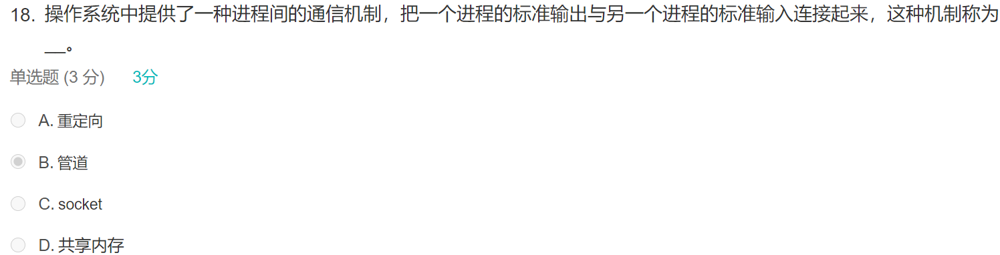
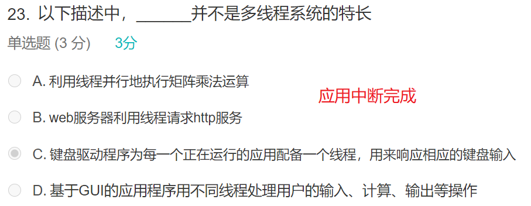
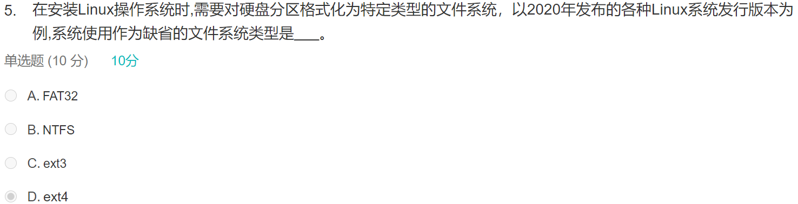
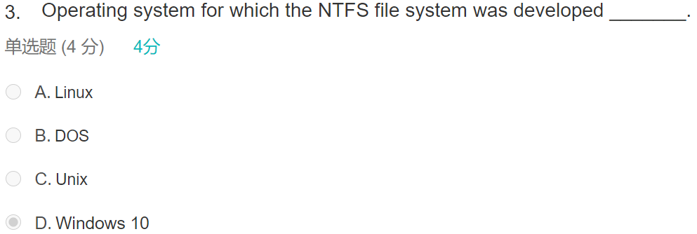

- 40选择 1.5一个 10分填空 30分大题

- DMA：不在CPU参与的情况下在设备之间搬运数据

- 注意措辞和RISCV的区别

  - Interrupts and Traps
  - 确定中断源：polling / vectored interrupt system

- SMP：共享物理memory，Symmetric Multiprocessing Architecture

- NUMA：Non-Uniform Memory Access

  

- 等待信号量：running状态到blocked状态

- 选择题比较多

- 进程间通信 IPC

  

  - 共享内存
  - 消息传递

- 同步肯定有一道大题

- 同步

  - Race condition
  - CS Critical Section

- monolithic

- batch / time sharing / real time

- B（主存会涉及到，因为需要读写PCB）

  

### JJM习题

- 

- 

- Solution to Critical-Section: Three Requirements

- working set

- 

  

- 

- 

- thrashing

  - the processor spends most of its time in swapping pages, rather than executing them

- Belady’s Anomaly 异常

  - 采用FIFO算法时，如果对—个进程未分配它所要求的全部页面，有时就会出现分配的页面数增多但缺页率反而提高的异常现象

- 页替换的second chance

  - 指针指向的是下一个要被替换的page

  

- 

- Name three ways in which the processor can transition form user mode to kernel mode? 

  - 1) The user process can execute a trap instruction (e.g. system call).A trap is known asa synchronous software interrupt.

    2) The user process can cause an exception (divide by zero, access badaddress, bad instruction, page fault, etc).

    3) The processor can transition into kernel mode when receiving aninterrupt.

- 

- 

- context switch

  - Ingeneral, the operating system must **save the state** of the currently running process and restore the state of the process scheduled to be run next. Saving the stateof a process typically includes the values of all the CPU registers in additionto memory allocation. 
  - **Context switches must also perform manyarchitecture-specific operations, including flushing data and instruction caches.**

- 

- 

- 

- 

- 

- 响应比=作业响应时间/作业执行时间=(作业执行时间十作业等待时间)/作业执行时间。高响应比调度算法在等待时间相同的情况下，作业执行时间越短响应比越高，满足短任务优先。随着等待时间增加，响应比也会变大，执行机会就增大，所以不会产生饥饿现象。先来先服务和时间片轮转不符合短作业优先，非抢占式短作业优先会产生饥饿现象。

  

  

- 调度相关术语

  - throughput: the number of processes completed per time unit

  

- 

- 

- 

- inverted page table

  

- 

- EAT

- 

  

- 

- second-chance？

  

- NRU？

  

- 

- 信号量相关习题

  - https://www.gatevidyalay.com/semaphore-binary-semaphore-practice-problems/

- 

- 

### Introduction

- ssd，均匀擦除 solid state disk
- 系统调用传递参数：寄存器，内存的block，压栈

